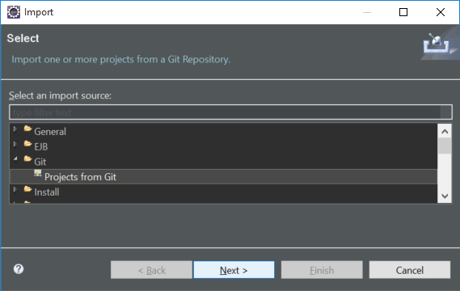
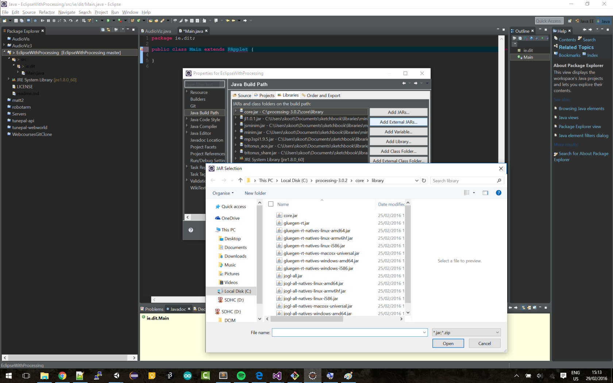
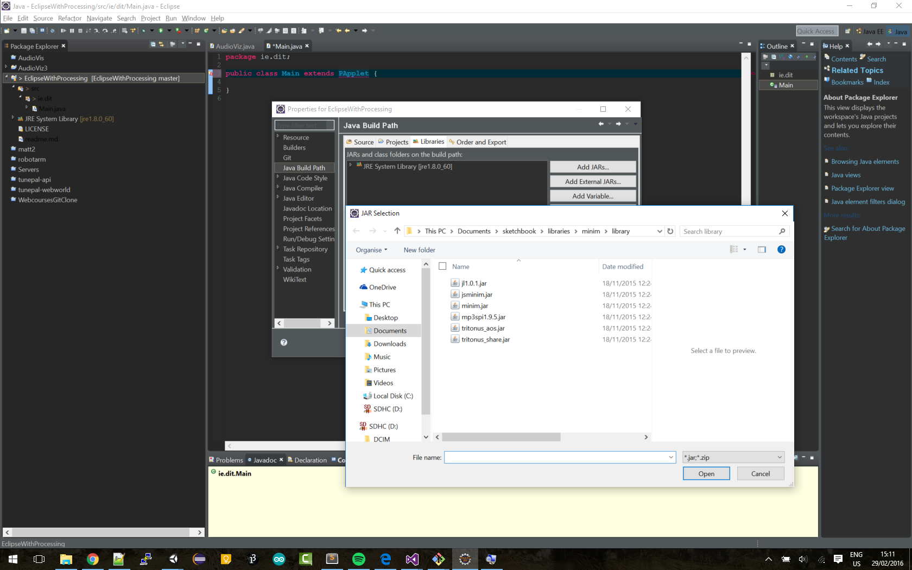

# Using Processing libraries from Eclipse

## Instructions

- Go to File | Import | Git | Projects from Git



- Click next and choose Clone URI
- Enter the URL for this repo
- Click through the subsequent screens and accept the defaults
- Choose Import Existing Eclipse Projects and click Finish

You should now have the project imported, but it wont build or run because you have to link with the Processing jar file.

- Right click on the project in the workspace and choose Properties | Java Build Path and click the button Add External Jar
- Find the file core.jar. On my computer, it's located in ```C:\processing-3.0.2\core\library```



If you also want to also link with minim, the first think to do is launch the Processing IDE and install the Minim library. 

- Go to Sketch | import library and choose Minim
- Swicth back to Eclipse and go to Add External Jar again. On my computer the Minim libraries are located in ```C:\Users\skoot\Documents\sketchbook\libraries\minim```
- You need to choose all the Jar files this time.


